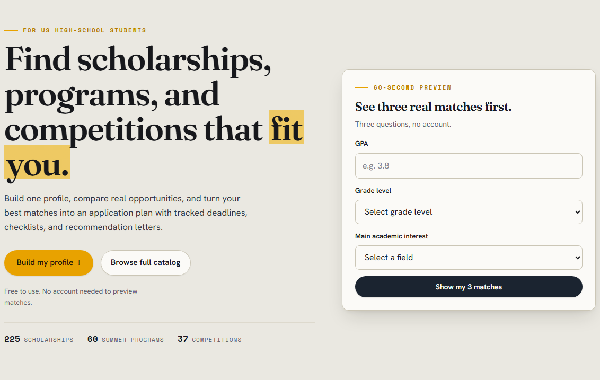
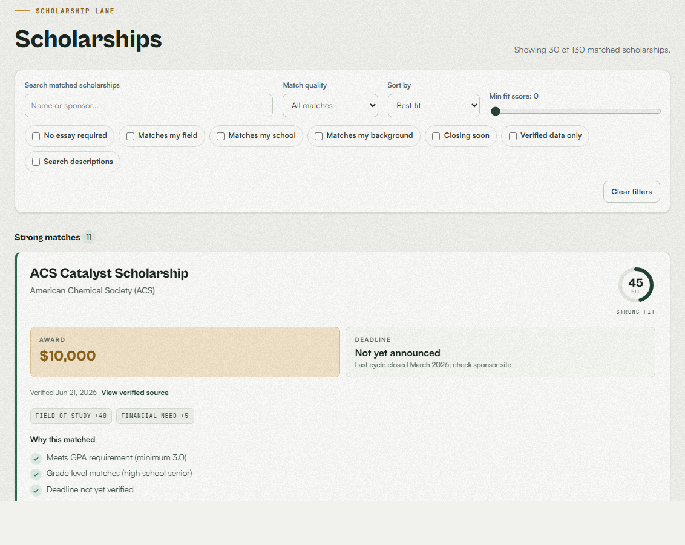
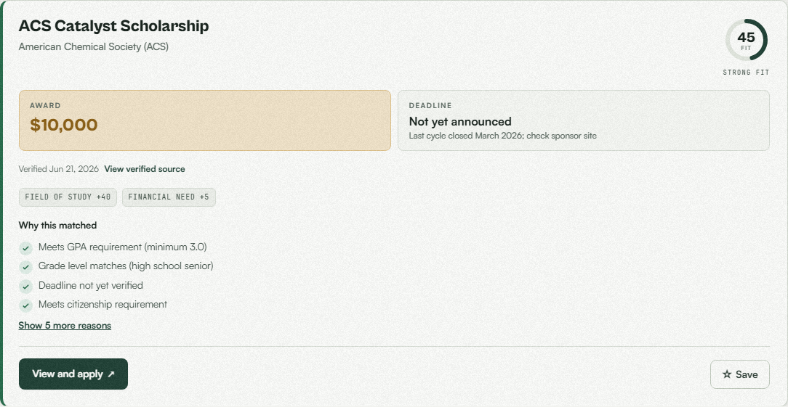

# EnsureCollege

**Live:** [ensurecollege.com](https://ensurecollege.com/)

EnsureCollege is a **college-planning web app** for U.S. high-school students. One profile finds the scholarships, elite summer programs, and academic competitions that fit; a built-in planning layer turns saved opportunities into an application plan with tracked deadlines, source-linked requirement checklists, a recommendation-letters rollup, and weekly email reminders. The catalog is curated and manually verified against official sponsor pages, and every opportunity has its own indexable public page.

> **What this is:** a student-built planner with honest data provenance, not a comprehensive search engine. Always confirm eligibility and deadlines on each sponsor's official site.

## Screenshots

| Hero & profile flow | Match results | Result detail |
| --- | --- | --- |
|  |  |  |

Screenshots are captured with `scripts/capture_readme_screenshots.py` and may trail the live UI.

## How it works

**Three opportunity lanes, one profile.** The profile form collects GPA, grade level, citizenship, state, financial-need level, fields of study, optional demographic tags, target schools, and activities across three short steps. The same profile powers three matchers:

- **Scholarships** are scored with a transparent additive algorithm over field-of-study overlap, demographic overlap, target-school match, activity keywords, and a need-based signal. GPA, grade level, state, citizenship, and passed deadlines act as hard gates only when the dataset holds a real value (never on a `VERIFY` placeholder). Results split into **Strong**, **Possible**, and **Special opportunities to check** (niche gates like nomination, membership, or finalist status the profile cannot verify).
- **Elite summer programs** reuse the same gates and add a financial-access signal for free or stipend-paying programs.
- **Competitions** mirror the program matcher over a curated set of national academic competitions (olympiads, research fairs, essay and speech contests), with qualification-gated events surfaced as special checks.

Every match shows human-readable reasons plus score-component chips, and each lane has its own filters: match quality, sort (fit, name, deadline; award for scholarships), a minimum-fit-score slider, and applicable checkboxes (field match, closing soon, verified data; essay/school/background filters where they apply). Long result lists and the full catalog render in batches of 30 with a "Show more" control.

**60-second preview.** The hero embeds a live three-question demo (GPA, grade, interest) that runs the real matcher without an account, shows three matches, and reports how many more a full profile unlocks. Residency gates are flagged rather than applied in preview mode.

**Public opportunity pages.** Every catalog entry has a server-rendered page (for example `/scholarships/coca-cola-scholars`) with award, deadline, eligibility, application requirements, verification status with a link to the official source, and honest labeling for estimated or unverified data. A crawlable [`/browse`](https://ensurecollege.com/browse) directory and a full `sitemap.xml` make the catalog indexable; JSON-LD structured data uses honest schema.org types (`MonetaryGrant`, `EducationalOccupationalProgram`).

**The planning layer.** With a free account (email/password or Google sign-in), saved opportunities become an application plan: per-item status (interested, drafting, submitted, awarded, rejected), notes, persistent source-linked application checklists, a deadline timeline, essay-reuse themes, requirement comparisons, and a recommendation-letters rollup auto-derived from each saved item's checklist. An opt-in weekly email digest covers saved items closing within 14 days, plus an alert when newly added opportunities are a strong match for the saved profile.

**Accounts and privacy.** Accounts are optional; without one, nothing is retained between visits. Passwords are stored as bcrypt hashes; sessions use signed, httponly cookies; Google OAuth is supported. Account deletion removes the profile and every tracked opportunity.

**AI features (dormant by default).** Earlier releases included Anthropic-powered essay advice, draft review, and resume auto-fill. That code remains but is gated behind `AI_FEATURES_ENABLED` (default `false`), so no student data is sent to any AI provider unless the flag is deliberately enabled.

## Tech stack

- **Backend:** Python, FastAPI; Jinja2 for the server-rendered opportunity/browse pages
- **Frontend:** Vanilla HTML, CSS, and JavaScript served by FastAPI; a light-only, token-driven design system; batched rendering and View Transitions on lane switches
- **Curated data:** Pydantic models over local JSON files (scholarships, summer programs, competitions) loaded at startup
- **Accounts and saved data:** SQLAlchemy ORM, SQLite locally and Neon Postgres (pooled) in production, bcrypt hashing, signed session cookies, Google OAuth via Authlib
- **Schema migrations:** Alembic (build-time on Vercel; automatic at startup elsewhere)
- **Rate limiting:** Upstash Redis in production, in-memory fallback locally
- **Email:** Resend for password resets and the weekly reminder/alert digest (Vercel cron)

## Run locally

### 1. Create a virtual environment

```bash
python -m venv .venv
```

Windows: `.venv\Scripts\activate` · macOS/Linux: `source .venv/bin/activate`

### 2. Install dependencies

```bash
pip install -r requirements.txt
pip install -r requirements-dev.txt  # for tests
alembic upgrade head                 # the app also does this at startup
```

### 3. Configure the environment

```bash
copy .env.example .env   # cp on macOS/Linux
```

Set `SESSION_SECRET` (any long random string). Everything else is optional locally: without `DATABASE_URL` the app uses a local SQLite file; without Resend variables, password reset reports itself unavailable instead of pretending; `ANTHROPIC_API_KEY` only matters if you enable `AI_FEATURES_ENABLED`.

### 4. Start the server

```bash
uvicorn app.main:app --reload --port 8099
```

Open [http://127.0.0.1:8099/](http://127.0.0.1:8099/). Port 8099 is the canonical dev port; the local Google OAuth configuration expects it.

## Deploy

Production runs on **Vercel** (`@vercel/python`, `api/index.py` + `vercel.json`) with Neon Postgres and Upstash Redis:

1. Import the repo into Vercel.
2. Provision **Neon Postgres** (copy the **pooled** connection string; host contains `-pooler`) and **Upstash Redis** (REST URL + token).
3. Set environment variables: `DATABASE_URL`, `UPSTASH_REDIS_REST_URL`, `UPSTASH_REDIS_REST_TOKEN`, `RUN_MIGRATIONS_ON_STARTUP=false` (Alembic runs at build time), `PUBLIC_APP_URL`, `SESSION_SECRET`, `SESSION_COOKIE_SECURE=true`, `RESEND_API_KEY`, `EMAIL_FROM`, `GOOGLE_CLIENT_ID`, `GOOGLE_CLIENT_SECRET`, and `CRON_SECRET` (guards the weekly reminder cron defined in `vercel.json`).
4. Add the custom domain (`ensurecollege.com`) and set DNS as directed.

`render.yaml` remains for a Render deployment (web service + free Postgres), and the app also runs on Railway with the standard `uvicorn` start command; see those platforms' docs. On any host, never commit secrets; set them in the host's environment UI.

## API and page routes

| Method | Path | Description |
|--------|------|-------------|
| `GET` | `/` | Web app |
| `GET` | `/health`, `/robots.txt`, `/sitemap.xml` | Health check and crawler surfaces (sitemap covers every opportunity page) |
| `GET` | `/scholarships/{slug}`, `/programs/{slug}`, `/competitions/{slug}` | Server-rendered opportunity pages |
| `GET` | `/browse`, `/browse/{kind}` | Crawlable catalog directories |
| `GET` | `/vocabulary` | Form option lists |
| `GET` | `/scholarships`, `/programs`, `/competitions` | Full datasets (JSON) |
| `POST` | `/match`, `/programs/match`, `/competitions/match` | Rank each lane for a profile |
| `POST` | `/match/preview` | Three-question hero preview (no account) |
| `POST` | `/auth/signup`, `/auth/login`, `/auth/logout`, `/auth/change-password`, `/auth/delete-account` | Email/password accounts |
| `GET` | `/auth/me`, `/auth/google/login` (+ callback) | Session info and Google OAuth |
| `POST` | `/auth/password-reset/request`, `/auth/password-reset/confirm` | One-time reset links |
| `GET/PUT` | `/account/profile` | Saved profile |
| `GET` | `/account/saved` | Saved opportunities (all three kinds) |
| `POST/PATCH/DELETE` | `/account/saved/{id}`, `/account/saved/programs/{id}`, `/account/saved/competitions/{id}` | Save, track status/notes/checklists, remove |
| `PATCH` | `/account/reminders` | Email digest opt-in/out |
| `GET` | `/reminders/run` | Weekly digest + new-match alerts (cron, guarded by `CRON_SECRET`) |
| `POST` | `/essay-advice`, `/essay-review`, `/resume/extract` | Dormant unless `AI_FEATURES_ENABLED=true` |

## Tests

```bash
python -m pytest tests/ -v
```

The suite (274 tests) mocks all external calls; no paid API usage. GitHub Actions runs tests and the dataset validator on every push.

Smoke-test the live deployment with `python scripts/smoke_test_live.py`.

## Data verification

The datasets in [`app/data/`](app/data/) — `scholarships.json`, `summer_programs.json`, and `competitions.json` — are **curated seed sets** of real opportunities, verified incrementally against official sponsor pages. As of July 2026 the catalog holds **225 scholarships, 60 elite summer programs, and 37 competitions**, every entry with official source provenance.

- **`verified: true`** — key facts (award, eligibility, and the current cycle's deadline where published) were checked against the sponsor's official page.
- **`verified: false`** — not yet confirmed; unknown fields hold `VERIFY` placeholders. The matcher treats `VERIFY` permissively (it never excludes on an unknown value) and the UI labels the entry.
- Deadlines are set **only when the sponsor has published the current cycle's date**; otherwise an `estimated_deadline` from the previous cycle is shown explicitly as an estimate. A wrong deadline in a student-facing tool is worse than an honest placeholder.
- `last_verified_at` records a fresh fact audit; audits older than 90 days are flagged for re-checking. Niche eligibility gates live in [`special_requirements.json`](app/data/special_requirements.json) and surface as special checks, never as ordinary Strong matches.

Run `python scripts/validate_dataset.py` for current verified counts, remaining placeholders, and the re-verification queue. It exits non-zero on structural errors, suitable for CI.

## Project structure

```
ScholarMatch/
├── vercel.json / render.yaml
├── requirements.txt / requirements-dev.txt
├── api/index.py        (Vercel entry)
├── tests/
├── docs/               (specs, plans, brand)
└── app/
    ├── main.py         (routes, sitemap, security headers)
    ├── seo_pages.py    (server-rendered opportunity + browse pages)
    ├── templates/      (Jinja2: base, detail, browse, 404)
    ├── api/            (account, saved, reminder routes)
    ├── auth/           (passwords, sessions, Google OAuth, email)
    ├── db/             (engine, ORM models, migrations glue)
    ├── matching/       (scholarship, program, competition matchers)
    ├── models/         (Pydantic domain models)
    ├── alerts.py / reminders.py
    ├── static/         (index.html, css, js, images)
    └── data/           (scholarships, summer_programs, competitions, special_requirements)
```

## Limitations

- The catalog is a curated set, not a comprehensive directory; some fields remain honestly marked `VERIFY` until sponsors publish current-cycle facts.
- AI features are disabled by default and the code path is dormant; enabling them incurs Anthropic API costs and re-exposes the consent flows.
- Email verification for accounts is not implemented; the age/terms notice is a stored acknowledgment, not age verification. Not a production service for children under 13.
- Rate limiting uses Upstash Redis in production and an in-memory fallback locally; the fallback is per-instance only.
- EnsureCollege is **not** an official scholarship search or application service; matches are suggestions, not guarantees.

## License

MIT — see [LICENSE](LICENSE).

## Future work

- Matcher improvements (field-proximity scoring, richer explanations)
- Decide the essay-tools fork (re-enable AI features or build non-AI essay support)
- Continue dataset expansion and the seasonal re-verification pass (most sponsors post next-cycle deadlines August–October)
- Accessibility (WCAG 2.2) audit and client bundle slimming
